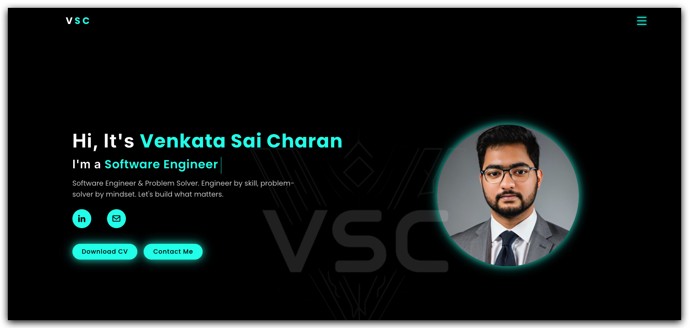

# 🚀 My Personal Portfolio Website

Welcome to the GitHub repository for my personal portfolio website! This project is a modern, interactive showcase of my skills, experience, education, certifications, and projects as a Software Engineer. It is designed for a clean, professional, and engaging user experience.

---

## 🌐 Live Site

✨ **[https://www.venkatasaicharan.com](https://www.venkatasaicharan.com)** ✨

---

## 🆕 Recent Major Improvements (2025)
- **Organization Logo Integration**: Added authentic company logos (UMKC, Trbhi INC, Source Consulting LLC, Wipro Technologies, St. Joseph's College, Merizon Technologies) throughout the portfolio for enhanced visual credibility.
- **Accurate Timeline Data**: Updated Journey page with precise education and work experience timeline matching real career progression.
- **Enhanced Mobile Experience**: Fixed timeline squeeze issues, improved responsive design, and optimized mobile navigation.
- **UI/UX Refinements**: Reduced header size, improved logo placement, fixed navbar stability, and removed custom cursor for better accessibility.
- **Privacy & Cleanup**: Removed phone number, Instagram, and Twitter links for enhanced privacy and cleaner presentation.
- **Performance Optimizations**: Fixed AnimatePresence warnings and improved animation performance across all components.
- **Deep Clean:** Removed all unused files, Dockerfile, Angular project, and legacy API endpoints.
- **SPA Routing Fix:** Corrected Vercel deployment to support client-side routing for all pages (including `/blog`).
- **Single Branch Deployment:** Now deployed exclusively from the `main` branch on Vercel. No more `gh-pages` branch or GitHub Pages.
- **Removed AI Chat:** All AI Chat Assistant and related backend code have been fully removed for a cleaner, faster site.

---

## ✨ Key Features
- **Modern, Responsive UI/UX**: Built with React, Vite, and Tailwind CSS for a seamless experience on all devices.
- **Animated Hero Section**: Typewriter animation cycles through multiple roles/titles.
- **Dynamic Sections**: About, Skills, Education, Certifications, Experience, Projects, and Blog.
- **Interactive Project & Experience Cards**: With filtering, sorting, and hover effects.
- **Professional Blog**: Single-page blog with sticky Table of Contents and anchor links.
- **Contact Form**: EmailJS-powered, with confetti animation on success.
- **Integrated Social Links**: LinkedIn, Email, GitHub, and more.
- **Organization Branding**: Authentic company logos integrated throughout experience and journey sections.
- **Optimized for Performance**: Fast builds and global delivery via Vercel.

---

## ⚙️ Tech Stack
- **Frontend:** React, Vite, Tailwind CSS
- **Icons:** Boxicons, React Icons
- **Animations:** Framer Motion, react-simple-typewriter
- **Email Integration:** EmailJS
- **Deployment:** Vercel (with correct SPA routing via `vercel.json`)
- **Performance Monitoring:** Vercel Analytics, Speed Insights

---

## 📦 Getting Started: Developer Instructions

### Prerequisites
- Node.js (https://nodejs.org/)

### Installation
    ```bash
git clone https://github.com/KVSC1511/MyPortfolio.git
cd MyPortfolio
    npm install
    ```

### Running the Development Server
```bash
npm run dev
```

### Building for Production
```bash
npm run build
```

### Previewing the Production Build
```bash
npm run preview
```

---

## 📝 Customization Guide
- **Replace Profile Images**:
    - Locate your profile images in `assets/images/Thumbnail.jpg` and other relevant files in `assets/`.
    - Replace these files with your own images, keeping the same file names or updating the paths in `src/App.jsx` and `README.md` accordingly.
- **Update Social Media URLs**:
    - Open `src/App.jsx`.
    - Find the social links section and update the `href` attributes of the `<a>` tags with your own LinkedIn and email links.
- **Edit Content Sections (About, Skills, Education, Experience, Projects)**:
    - The content for these sections is primarily managed within the `src/App.jsx` file.
    - Edit the text, dates, descriptions, and tech stacks within the respective sections to reflect your own information and achievements.
- **Configure EmailJS**:
    - Open `src/components/Contact.jsx`.
    - Sign up for a free account on [EmailJS](https://www.emailjs.com/).
    - Replace the placeholder public key with your actual EmailJS public key.
    - Configure your EmailJS service, template, and account to receive emails.
- **Customize Tailwind Styles**:
    - Tailwind CSS is used for all styling. You can customize the theme (colors, fonts, spacing, etc.) by editing `tailwind.config.js`.
    - Modify existing utility classes in your JSX files or add new custom CSS in `src/index.css` using Tailwind's `@apply` directive if needed.
- **Edit Blog Sections & TOC:**
    - To add or update blog sections, edit the relevant components in `src/` and update the TOC/sidebar for new anchor links.
- **Animated Hero Roles:**
  - To customize the animated roles/titles in the hero section, edit the `words` array in the `<Typewriter />` component in `src/App.jsx`.
- **Organization Logos:**
    - Add your organization logos to `public/images/` and update the logo constants in `src/pages/Journey.jsx` and `src/pages/Experience.jsx`.
    - Ensure logos have transparent backgrounds for optimal display.

---

## 📸 Project Screenshot


---

## 🛠️ Project Structure (2025)
```
MyPortfolio/
├── assets/           # All images, icons, and static assets
│   ├── images/
│   │   ├── Thumbnail.jpg
│   │   ├── ...
│   └── icons/
│       ├── ...
├── public/           # Public files and organization logos
│   ├── images/
│   │   ├── umkclogo.png
│   │   ├── trbhilogo.png
│   │   ├── sc_logo.png
│   │   ├── wiprologo.svg
│   │   ├── SJCElogo.png
│   │   ├── MTlogo.png
│   │   └── ...
├── src/              # React source code
│   ├── components/   # Reusable React components
│   ├── data/         # Data files (e.g., blogData.js)
│   ├── pages/        # Page-level components
│   ├── App.jsx       # Main application component
│   ├── index.css     # Global styles and Tailwind directives
│   ├── main.jsx      # Entry point for the React application
│   └── ...
├── dist/             # Build output (auto-generated)
├── vercel.json       # Vercel SPA routing config
├── package.json      # Project metadata and scripts
├── tailwind.config.js# Tailwind CSS configuration
├── vite.config.js    # Vite build configuration
├── README.md         # This file
└── ...
```

---

## 🧩 Notable Libraries Used
- [`react-icons`](https://react-icons.github.io/react-icons/): Popular icon sets as React components.
- [`boxicons`](https://boxicons.com/): Open-source vector icons for navigation and social links.
- [`framer-motion`](https://www.framer.com/motion/): Motion library for React animations.
- [`react-simple-typewriter`](https://www.npmjs.com/package/react-simple-typewriter): Animated typewriter effect in the hero subtitle.
- [`emailjs`](https://www.emailjs.com/): Send emails directly from the client-side.
- [`@vercel/speed-insights`](https://vercel.com/docs/speed-insights): Collect performance metrics on Vercel.

---

## 🛡️ License
MIT

---

## Contributing
I welcome contributions to improve this portfolio! If you have suggestions for new features, find a bug, or want to improve the documentation, please feel free to:
1. **Fork the repository.**
2. **Create a new branch** for your feature or bugfix.
3. **Make your changes** and commit them with clear, concise messages.
4. **Push your branch** to your fork.
5. **Open a Pull Request** to the `main` branch of this repository, describing your changes.

I'll review your contribution and work with you to get it merged.

---

## 🤝 Connect with Me
- **LinkedIn**: [https://www.linkedin.com/in/sai-charan-k-v/](https://www.linkedin.com/in/sai-charan-k-v/)
- **Email**: [saicharankarasala@gmail.com](mailto:saicharankarasala@gmail.com)
- **GitHub**: [https://github.com/KVSC1511](https://github.com/KVSC1511)

Feel free to reach out for collaborations, questions, or just to say hello!

---

## 🙏 Acknowledgements
- Inspired by various modern portfolio designs.
- Thanks to the creators of the libraries and frameworks used in this project.

---

## 🙋‍♂️ Author
**Venkata Sai Charan**

> **Note:** This README reflects the current, clean, and modern state of the project as of 2025. For any questions or suggestions, feel free to reach out!


