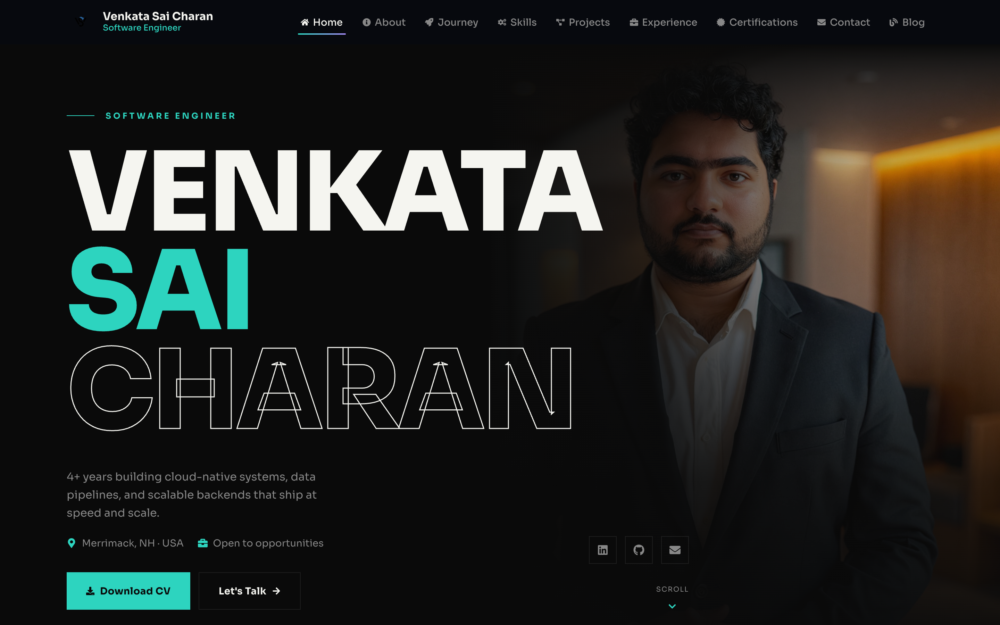

# Venkata Sai Charan — Portfolio

A cinematic, dark-premium personal portfolio built with React + Vite. Designed to make recruiters stop and say **wow**.



---

## Live Site

**[https://www.venkatasaicharan.com](https://www.venkatasaicharan.com)**

---

## Design Philosophy

- **Editorial magazine aesthetic** — oversized stacked typography, sharp corners, no border-radius
- **Deep space dark theme** — `#0a0a0a` background, teal + violet accents, SVG noise texture + horizontal grid lines for depth
- **Cinematic interactions** — magnetic cursor, cursor spotlight glow (700px radial gradient), text scramble on headings, infinite scroll bands between sections
- **Every page is intentional** — no empty space, every hero section fills the right column with contextual content

---

## Pages

| Page | Description |
|------|-------------|
| **Home** | Full-bleed photo hero, stacked giant name, animated stats, selected work list |
| **About** | Two-column hero with quick-facts card, story, philosophy, timeline |
| **Skills** | Tag clouds by domain, filter nav, 50+ technologies |
| **Projects** | Always-visible thumbnails, click-to-expand modal, 6-project mosaic hero |
| **Experience** | Editorial year-number rows, company logo list, click-to-expand modal |
| **Certifications** | Badge showcase hero, featured certs grid, full list |
| **Journey** | Mini timeline hero, milestone rows, click-to-expand modal |
| **Contact** | Split layout — info card right, underline-only form |
| **Blog** | Dark reading experience, topic chips, search, glass cards |

---

## Tech Stack

| Layer | Tech |
|-------|------|
| Framework | React 18 + Vite 5 |
| Styling | Tailwind CSS 3 + CSS custom properties |
| Animation | Framer Motion 12 + GSAP 3 |
| Routing | React Router v6 |
| Email | EmailJS |
| Diagrams | Mermaid.js (blog) |
| Deploy | Vercel |

---

## Key Features

- **Magnetic cursor** — two-layer dot + ring, lerped follow, expands on hover
- **Cursor spotlight** — 700px teal/violet radial gradient that follows the mouse
- **Text scramble** — random chars settle into real words on scroll into view (homepage hero)
- **Scroll bands** — infinite marquee strips with page-specific text between sections
- **Loading screen** — letter-by-letter clip reveal + curtain-split exit (sessionStorage gated)
- **Page transitions** — `AnimatePresence mode="wait"` with slide variants
- **Dark glass modals** — `backdrop-filter: blur(12px)` with gradient accent bar
- **Noise + grid texture** — SVG fractalNoise + repeating horizontal lines on `body::before/after`
- **Responsive** — all interactive effects disabled on touch/coarse pointer devices

---

## Design Tokens

```css
--bg:          #0a0a0a   /* deep space black */
--bg-surface:  rgba(255,255,255,0.04)
--accent:      #2dd4bf   /* teal */
--accent2:     #a78bfa   /* violet */
--accent3:     #fbbf24   /* amber */
--text:        #f5f5f5
--text-muted:  #71717a
--border:      rgba(255,255,255,0.08)
```

---

## Getting Started

```bash
git clone https://github.com/saicharankarasala/sai-charan-website.git
cd sai-charan-website
npm install
npm run dev
```

Build for production:
```bash
npm run build
```

---

## Project Structure

```
src/
├── components/
│   ├── GradientOrb.jsx       # CSS blob orbs for background depth
│   ├── MagneticCursor.jsx    # Two-layer magnetic cursor
│   ├── CursorSpotlight.jsx   # Radial gradient spotlight
│   ├── ScrollBand.jsx        # Infinite marquee text strips
│   ├── LoadingScreen.jsx     # Letter reveal + curtain exit
│   ├── ScrollProgress.jsx    # Gradient top progress bar
│   └── BlogCard.jsx          # Dark glass blog card
├── hooks/
│   └── useTextScramble.js    # Text scramble animation hook
├── pages/
│   ├── Home.jsx
│   ├── About.jsx
│   ├── Skills.jsx
│   ├── Projects.jsx
│   ├── Experience.jsx
│   ├── Certifications.jsx
│   ├── Journey.jsx
│   ├── Contact.jsx
│   ├── BlogLanding.jsx
│   └── BlogPost.jsx
├── utils/
│   └── animations.js         # Framer Motion variants + GSAP helpers
├── data/
│   └── blogData.js
├── App.jsx
└── index.css                 # Design tokens, utilities, noise texture
```

---

## Customization

- **Colors** — edit CSS variables in `src/index.css` under `:root`
- **Content** — each page has its data defined inline at the top of the file
- **Blog posts** — add entries to `src/data/blogData.js`
- **EmailJS** — update service/template/key in `src/pages/Contact.jsx`
- **Resume** — replace `public/cv.pdf`

---

## Connect

- **LinkedIn** — [linkedin.com/in/sai-charan-k-v](https://www.linkedin.com/in/sai-charan-k-v/)
- **GitHub** — [github.com/KVSC1511](https://github.com/KVSC1511)
- **Email** — saicharankarasala@gmail.com

---

## License

MIT
