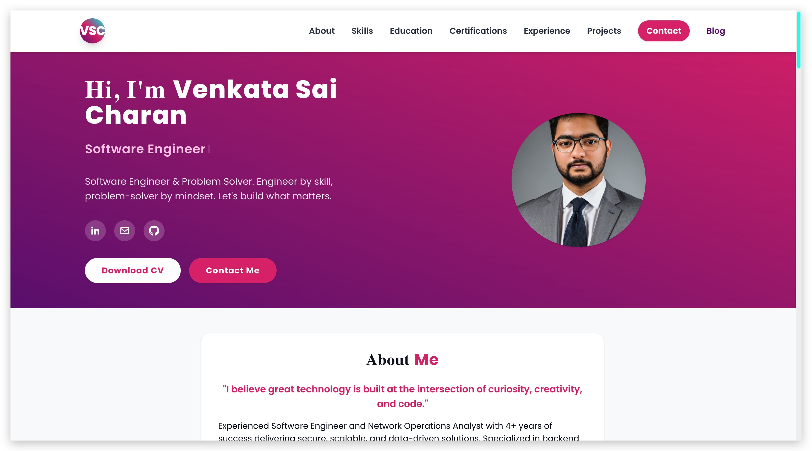

# 🚀 My Personal Portfolio Website

Welcome to the GitHub repository for my personal portfolio website! This project is a modern, interactive showcase of my skills, experience, education, certifications, and projects as a Software Engineer. It is designed for a clean, professional, and engaging user experience.

---

## 🌐 Live Site

✨ **[https://www.venkatasaicharan.com](https://www.venkatasaicharan.com)** ✨

---

## 🆕 Recent Major Improvements (2025)
- **Enhanced Skills Section**: Added specific, related icons for each technology and improved performance with faster animations
- **SEO Optimizations**: Fixed meta description length, added proper H1 tags, and improved search engine discoverability
- **Project Cleanup**: Removed unused files, images, and directories for better organization and faster builds
- **Performance Improvements**: Optimized animations, removed legacy code, and enhanced mobile responsiveness
- **Organization Logo Integration**: Added authentic company logos (UMKC, Trbhi INC, Source Consulting LLC, Wipro Technologies, St. Joseph's College, Merizon Technologies) throughout the portfolio for enhanced visual credibility
- **Accurate Timeline Data**: Updated Journey page with precise education and work experience timeline matching real career progression
- **Enhanced Mobile Experience**: Fixed timeline squeeze issues, improved responsive design, and optimized mobile navigation
- **UI/UX Refinements**: Reduced header size, improved logo placement, fixed navbar stability, and removed custom cursor for better accessibility
- **Privacy & Cleanup**: Removed phone number, Instagram, and Twitter links for enhanced privacy and cleaner presentation
- **Single Branch Deployment**: Now deployed exclusively from the `main` branch on Vercel. Removed `gh-pages` branch and GitHub Pages workflow
- **Deep Clean:** Removed all unused files, Dockerfile, Angular project, legacy API endpoints, and system files

---

## ✨ Key Features
- **Modern, Responsive UI/UX**: Built with React, Vite, and Tailwind CSS for a seamless experience on all devices
- **Multi-Page Structure**: Professional navigation with dedicated pages for Home, About, Skills, Projects, Experience, Certifications, Contact, Journey, and Blog
- **Animated Hero Section**: Typewriter animation cycles through multiple roles/titles
- **Enhanced Skills Display**: 50+ skills with specific icons, categorized filtering, and performance-optimized animations
- **Interactive Project & Experience Cards**: With filtering, sorting, and hover effects
- **Professional Blog**: Single-page blog with sticky Table of Contents and anchor links
- **Contact Form**: EmailJS-powered, with confetti animation on success
- **Integrated Social Links**: LinkedIn, Email, GitHub, and more
- **Organization Branding**: Authentic company logos integrated throughout experience and journey sections
- **Optimized for Performance**: Fast builds and global delivery via Vercel
- **SEO Optimized**: Comprehensive meta tags, structured data, and search engine optimization

---

## ⚙️ Tech Stack
- **Frontend:** React, Vite, Tailwind CSS
- **Icons:** Boxicons, React Icons (with specific skill-related icons)
- **Animations:** Framer Motion, react-simple-typewriter
- **Email Integration:** EmailJS
- **Deployment:** Vercel (with correct SPA routing via `vercel.json`)
- **Performance Monitoring:** Vercel Analytics, Speed Insights
- **SEO:** React Helmet Async, comprehensive meta tags, structured data

---

## 📦 Getting Started: Developer Instructions

### Prerequisites
- Node.js (https://nodejs.org/)

### Installation
```bash
git clone https://github.com/KVSC1511/MyPortfolio.git
cd MyPortfolio
npm install
```

### Running the Development Server
```bash
npm run dev
```

### Building for Production
```bash
npm run build
```

### Previewing the Production Build
```bash
npm run preview
```

---

## 📝 Customization Guide
- **Replace Profile Images**:
    - Locate your profile images in `public/images/` and `assets/images/Thumbnail.jpg`
    - Replace these files with your own images, keeping the same file names or updating the paths accordingly
- **Update Social Media URLs**:
    - Open `src/App.jsx`
    - Find the social links section and update the `href` attributes of the `<a>` tags with your own LinkedIn and email links
- **Edit Content Sections**:
    - Each section has its own dedicated page component in `src/pages/`
    - Edit the content within the respective page components to reflect your own information and achievements
- **Configure EmailJS**:
    - Open `src/components/Contact.jsx`
    - Sign up for a free account on [EmailJS](https://www.emailjs.com/)
    - Replace the placeholder public key with your actual EmailJS public key
    - Configure your EmailJS service, template, and account to receive emails
- **Customize Tailwind Styles**:
    - Tailwind CSS is used for all styling. You can customize the theme (colors, fonts, spacing, etc.) by editing `tailwind.config.js`
    - Modify existing utility classes in your JSX files or add new custom CSS in `src/index.css` using Tailwind's `@apply` directive if needed
- **Edit Blog Sections & TOC**:
    - To add or update blog sections, edit the relevant components in `src/` and update the TOC/sidebar for new anchor links
- **Animated Hero Roles**:
    - To customize the animated roles/titles in the hero section, edit the `words` array in the `<Typewriter />` component in `src/pages/Home.jsx`
- **Organization Logos**:
    - Add your organization logos to `public/images/` and update the logo constants in `src/pages/Journey.jsx` and `src/pages/Experience.jsx`
    - Ensure logos have transparent backgrounds for optimal display
- **Skills Customization**:
    - Edit the skills array in `src/pages/Skills.jsx` to add/remove skills with appropriate icons
    - Import new icons from `react-icons/fa` as needed

---

## 📸 Project Screenshot


---

## 🛠️ Project Structure (2025 - Updated)
```
MyPortfolio/
├── assets/                    # Build artifacts and static assets
│   ├── images/
│   │   └── Thumbnail.jpg     # Portfolio screenshot
│   ├── index.css             # Compiled CSS
│   ├── index.js              # Compiled JavaScript
│   └── [build artifacts]     # Vite-generated files
├── public/                    # Public files and assets
│   ├── images/               # Organization logos and images
│   │   ├── umkclogo.png     # UMKC logo
│   │   ├── trbhilogo.png    # Trbhi INC logo
│   │   ├── sc_logo.png      # Source Consulting logo
│   │   ├── wiprologo.svg    # Wipro Technologies logo
│   │   ├── SJCElogo.png     # St. Joseph's College logo
│   │   ├── MTlogo.png       # Merizon Technologies logo
│   │   ├── vsclogo.png      # Personal logo (PNG)
│   │   ├── vsclogo.jpeg     # Personal logo (JPEG)
│   │   ├── vsc-logo.png     # Legacy logo
│   │   ├── profile.JPG      # Profile image
│   │   └── Thumbnail.jpg    # Portfolio screenshot
│   ├── certifications/      # PDF certificates
│   │   └── edureka-python.pdf
│   ├── cv.pdf              # Resume/CV
│   ├── favicon.ico         # Website favicon
│   ├── manifest.json       # PWA manifest
│   ├── robots.txt          # Search engine directives
│   └── sitemap.xml         # Site structure for SEO
├── src/                     # React source code
│   ├── components/          # Reusable React components
│   │   ├── AnimatedCertificationCard.jsx
│   │   ├── AnimatedSkillCard.jsx
│   │   ├── BackgroundLogo.jsx
│   │   ├── Blog.jsx
│   │   ├── BlogCard.jsx
│   │   ├── BlogNavbar.jsx
│   │   ├── Contact.jsx
│   │   ├── CustomCursor.jsx
│   │   ├── EnhancedContact.jsx
│   │   ├── HamburgerMenu.jsx
│   │   ├── LoadingScreen.jsx
│   │   ├── ParallaxBackground.jsx
│   │   ├── ParticleBackground.jsx
│   │   ├── ProjectShowcase.jsx
│   │   ├── ScrollProgress.jsx
│   │   ├── SkillsCarousel.jsx
│   │   └── VscLogo.jsx
│   ├── data/               # Data files
│   │   └── blogData.js     # Blog content and posts
│   ├── pages/              # Page-level components
│   │   ├── About.jsx       # About page
│   │   ├── BlogLanding.jsx # Blog landing page
│   │   ├── BlogPost.jsx    # Individual blog post
│   │   ├── Certifications.jsx # Certifications page
│   │   ├── Contact.jsx     # Contact page
│   │   ├── Experience.jsx  # Experience page
│   │   ├── Home.jsx        # Home page
│   │   ├── Journey.jsx     # Journey timeline page
│   │   ├── Logo.jsx        # Logo page
│   │   ├── Projects.jsx    # Projects page
│   │   └── Skills.jsx      # Skills page
│   ├── App.jsx             # Main application component
│   ├── index.css           # Global styles and Tailwind directives
│   ├── main.jsx            # Entry point for the React application
│   └── output.css          # Compiled Tailwind CSS
├── certifications/         # Local certificate files
│   └── edureka-python.pdf
├── cv.pdf                 # Resume/CV
├── index.html             # Main HTML file
├── vercel.json            # Vercel SPA routing config
├── package.json           # Project metadata and scripts
├── package-lock.json      # Dependency lock file
├── tailwind.config.js     # Tailwind CSS configuration
├── vite.config.js         # Vite build configuration
├── postcss.config.js      # PostCSS configuration
├── README.md              # This file
├── ENHANCEMENT_GUIDE.md  # Development guide
└── LICENSE                # MIT License
```

---

## 🧩 Notable Libraries Used
- [`react-icons`](https://react-icons.github.io/react-icons/): Popular icon sets as React components with specific skill-related icons
- [`boxicons`](https://boxicons.com/): Open-source vector icons for navigation and social links
- [`framer-motion`](https://www.framer.com/motion/): Motion library for React animations with optimized performance
- [`react-simple-typewriter`](https://www.npmjs.com/package/react-simple-typewriter): Animated typewriter effect in the hero subtitle
- [`emailjs`](https://www.emailjs.com/): Send emails directly from the client-side
- [`@vercel/speed-insights`](https://vercel.com/docs/speed-insights): Collect performance metrics on Vercel
- [`react-helmet-async`](https://github.com/staylor/react-helmet-async): SEO optimization with meta tags
- [`mermaid`](https://mermaid.js.org/): Diagram generation for blog content

---

## 🛡️ License
MIT

---

## Contributing
I welcome contributions to improve this portfolio! If you have suggestions for new features, find a bug, or want to improve the documentation, please feel free to:
1. **Fork the repository**
2. **Create a new branch** for your feature or bugfix
3. **Make your changes** and commit them with clear, concise messages
4. **Push your branch** to your fork
5. **Open a Pull Request** to the `main` branch of this repository, describing your changes

I'll review your contribution and work with you to get it merged.

---

## 🤝 Connect with Me
- **LinkedIn**: [https://www.linkedin.com/in/sai-charan-k-v/](https://www.linkedin.com/in/sai-charan-k-v/)
- **Email**: [saicharankarasala@gmail.com](mailto:saicharankarasala@gmail.com)
- **GitHub**: [https://github.com/KVSC1511](https://github.com/KVSC1511)

Feel free to reach out for collaborations, questions, or just to say hello!

---

## 🙏 Acknowledgements
- Inspired by various modern portfolio designs
- Thanks to the creators of the libraries and frameworks used in this project
- Special thanks to the React, Vite, and Tailwind CSS communities

---

## 🙋‍♂️ Author
**Venkata Sai Charan**

> **Note:** This README reflects the current, clean, and modern state of the project as of 2025. The project has been thoroughly cleaned up, optimized for performance, and enhanced with specific skill icons and improved SEO. For any questions or suggestions, feel free to reach out!


